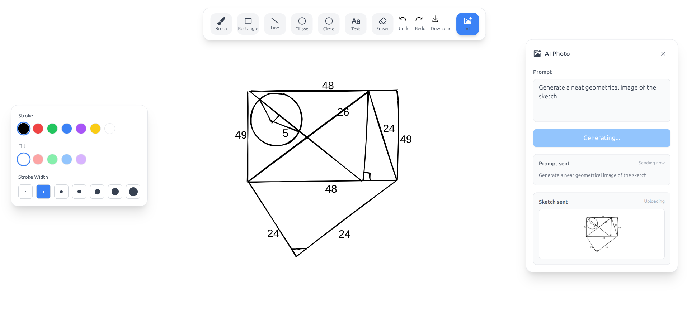

# WhiteBoard App

A simple whiteboard app made using React, Redux Toolkit, Tailwind CSS, Parcel, Rough.js, and Express backend.  
You can draw, add shapes and text, select parts of the canvas with the Drag tool, move selected items, copy/paste them, erase selected items, undo/redo actions, save board data, download PNG images, and generate AI images from your sketch using Gemini.

The app now supports a selection workflow for editing existing board content:

- Use **Drag** to draw a selection box around shapes, brush strokes, text, or generated images.
- Drag a selected item or selected group to move it around the board.
- Press `Ctrl+C` / `Cmd+C` to copy selected items.
- Press `Ctrl+V` / `Cmd+V` to paste copied items with a slight offset.
- Press `Delete` or `Backspace` to erase the current selection.
- Press `Esc` to clear the selection.

## Screenshot



## Features

- Freehand brush drawing
- Rectangle, line, ellipse, and circle tools
- Add text on the board
- Change stroke and fill colors
- Eraser tool
- Drag selection tool for selecting and moving board elements
- Copy and paste selected elements
- Delete or backspace to erase selected elements
- Undo and redo support
- Save board data in browser using `localStorage`
- Download board as PNG image
- AI image generation from current sketch
- Separate backend to keep API key safe

## Drag Selection Controls

Choose the **Drag** tool from the toolbar to edit existing content. Click an element to select it, drag over a region to select multiple elements, then drag the selected area to move everything together.

Keyboard shortcuts:

```text
Ctrl/Cmd + C  Copy selected elements
Ctrl/Cmd + V  Paste copied elements
Delete        Erase selected elements
Backspace     Erase selected elements
Esc           Clear selection
Ctrl/Cmd + Z  Undo
Ctrl/Cmd + Y  Redo
```

## AI Working

The app sends the current board sketch to the backend:

```text
POST /api/realistic-photo
```

Backend sends the image to Gemini AI model.

Models used:

```env
GEMINI_TEXT_MODEL=gemini-2.5-flash
GEMINI_IMAGE_MODEL=gemini-2.5-flash-image
```

If image generation fails, backend returns the error message.

## Requirements

- Node.js 18+
- npm
- Gemini API key from Google AI Studio

Create `backend/.env`

```env
GEMINI_API_KEY=your_gemini_api_key
GEMINI_IMAGE_MODEL=gemini-2.5-flash-image
```

Create `frontend/.env`

```env
AI_ENDPOINT=http://127.0.0.1:8787/api/realistic-photo
```

Change `AI_ENDPOINT` when deploying the app.

## Setup

Install backend packages:

```bash
cd backend
npm install
```

Install frontend packages:

```bash
cd frontend
npm install
```

Check Gemini key:

```bash
cd backend
npm run check-ai-key
```

Run backend:

```bash
cd backend
npm start
```

Run frontend:

```bash
cd frontend
npm start
```

Backend runs on:

```text
http://127.0.0.1:8787
```

Frontend runs on:

```text
http://127.0.0.1:1234
```

If port `1234` is busy, frontend uses another free port automatically.

## Scripts

### Backend

Run backend server:

```bash
cd backend
npm start
```

Check Gemini API key:

```bash
cd backend
npm run check-ai-key
```

### Frontend

Run frontend:

```bash
npm start
```

or

```bash
npm run dev
```

Build frontend:

```bash
npm run build
```

Run test placeholder:

```bash
npm test
```

## Project Structure

```text
WhiteBoard-App/
├── assets/
├── backend/
│   ├── api/
│   ├── scripts/
│   ├── src/
│   │   ├── config/
│   │   ├── middleware/
│   │   ├── modules/
│   │   │   ├── ai/
│   │   │   └── health/
│   │   ├── routes/
│   │   └── server.js
│   └── package.json
├── frontend/
│   ├── scripts/
│   ├── src/
│   │   ├── components/
│   │   ├── hooks/
│   │   ├── store/
│   │   └── utils/
│   ├── package.json
│   └── tailwind.config.js
└── README.md
```

## Deployment

Frontend can be deployed as static files.  
Backend is needed for AI image generation because API key should stay on server side.

Build frontend:

```bash
cd frontend
npm run build
```

Backend environment variables:

```env
NODE_ENV=production
FRONTEND_URL=https://your-frontend-domain.com
GEMINI_API_KEY=your_gemini_api_key
GEMINI_IMAGE_MODEL=gemini-2.5-flash-image
```

Run backend:

```bash
cd backend
npm ci
npm start
```

Backend routes:

```text
GET  /health
POST /api/realistic-photo
```

Build frontend for production:

```bash
cd frontend
npm ci
npm run build
```

For Vercel backend deployment:

```text
api/realistic-photo.js
```

Frontend production env:

```env
AI_ENDPOINT=https://your-backend-domain.vercel.app/api/realistic-photo
```

Do not put `GEMINI_API_KEY` in frontend code.

## Notes

- Board data is saved in browser `localStorage`
- Clearing browser data removes saved drawings
- Board export downloads as `drawing.png`
- AI images download as `ai-image.svg` or `ai-image.png`
- AI tries to keep sketch layout similar to original drawing
